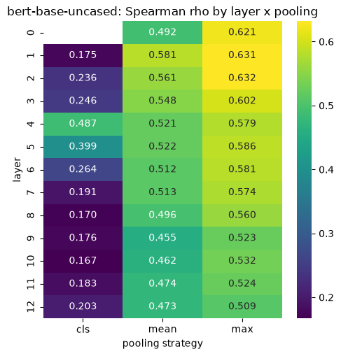
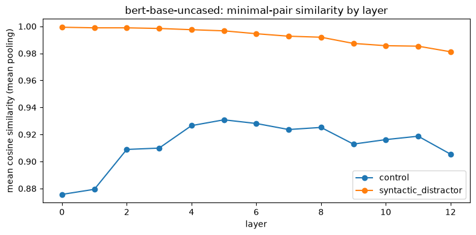
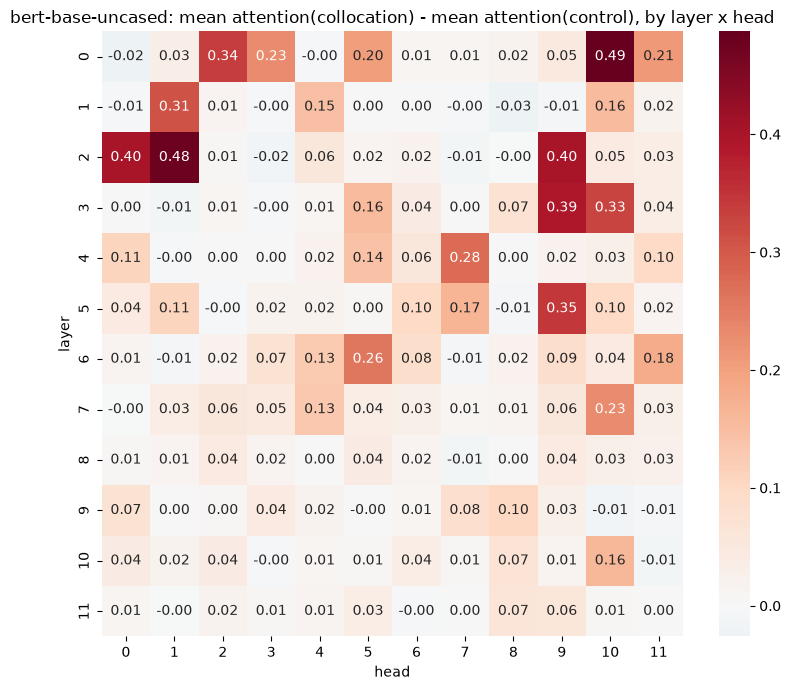
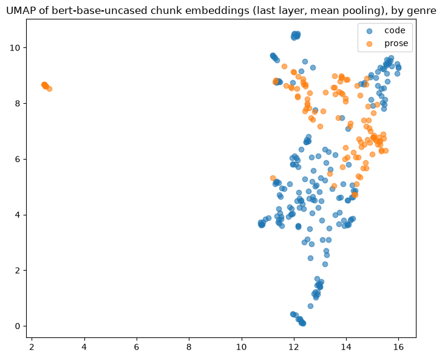
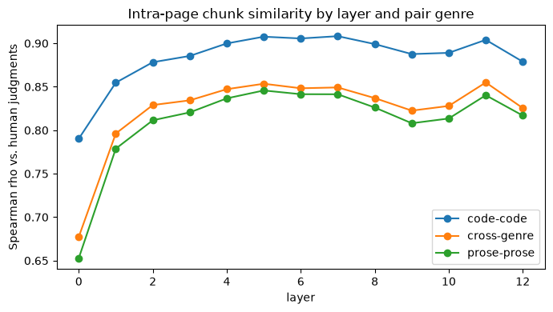
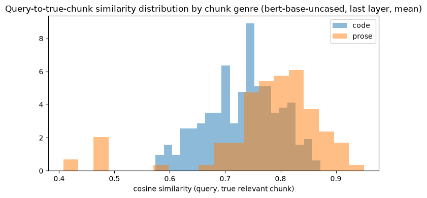
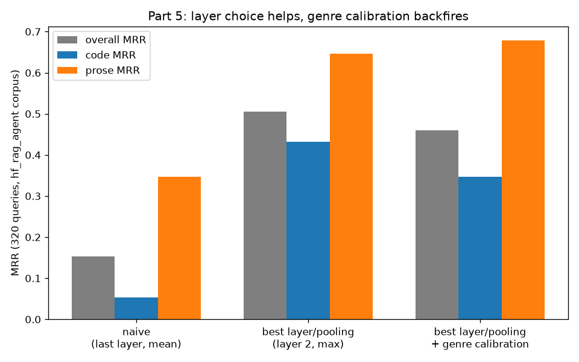

# BERToscope — What Embeddings Actually Encode

A systematic layer-by-layer probing study of BERT-family models — semantic similarity, syntactic structure, attention as linguistics, and text-genre divergence — motivated by a concrete RAG retrieval failure and closing with a data-driven, no-retraining fix.

I noticed my [RAG agent](#connection-to-the-other-projects) systematically preferred prose over code chunks from the same documentation page — its own measured numbers showed dense retrieval MRR of 0.773 for code vs. 0.837 for prose, dropping to 0.652 vs. 0.829 after reranking. This project is the diagnostic: a layer-by-layer dissection of what `bert-base-uncased` actually encodes, where cosine similarity misleads, and what the geometry of the embedding space implies for retrieval design.

> **Status:** all five parts complete, executed end-to-end with real data (not placeholder numbers) — STS-B, 30 hand-checked minimal pairs, 15 curated collocations, and the actual 320-chunk / 320-query corpus from the RAG agent project.

## The five parts

1. **Which layer encodes what?** — 12-layer × 3-pooling sweep of `bert-base-uncased` and `all-MiniLM-L6-v2` against STS-B. *Is "last layer + mean pooling" (SBERT's default) actually optimal, or just pragmatic?*
2. **Where does semantic similarity break?** — 30 hand-crafted minimal pairs (same syntactic frame, swapped content words) vs. genuine paraphrases. *Do upper layers escape syntactic surface form?*
3. **Can attention find collocations?** — attention-weight analysis across all 144 (layer, head) cells on 15 curated collocations ("strong tea", "make a decision"). *Is attention weight evidence of lexical understanding, or just adjacency?*
4. **The genre problem** — UMAP, intra-page similarity, and retrieval bias on the real `hf_rag_agent` corpus (320 chunks, 320 queries). *Does frozen BERT's geometry reproduce the measured code/prose retrieval gap?*
5. **Toward a fix** — does Part 1's best (layer, pooling) choice improve retrieval, and does a genre-aware score calibration help on top? *No retraining, just a different read of the same frozen model.*

## Results

### Part 1 — layer × pooling sweep (STS-B test, 1379 pairs)



`bert-base-uncased` peaks early — layer 2 + max pooling (ρ=0.632) — then *degrades* toward the last layer (ρ=0.473 at layer 12 with mean pooling, the SBERT-style default). `all-MiniLM-L6-v2` is the opposite: monotonically increasing, peaking exactly at the last layer + mean (ρ=0.820). **"Last layer + mean pooling" is optimal only for models trained to make it optimal** — for frozen, MLM-only BERT it's close to the worst point in the whole sweep.

### Part 2 — minimal pairs (30 hand-checked pairs)



Sentences with swapped grammatical roles and opposite meaning ("John is taller than Mary" vs. "Mary is taller than John") sit at 0.98-1.0 cosine similarity at *every* layer. Genuine paraphrases sit lower (0.88-0.93) at every layer and never catch up — 12 layers of self-attention never closes the gap.

### Part 3 — attention and collocations



The heads with the largest collocation-vs-control attention gap (0.275-0.487) cluster entirely in layers 0-5 — exactly where BERT's well-documented positional/adjacency heads live. Collocated words sit at a mean token distance of 1.2 vs. 4.2 for controls, and attention correlates with distance at r=-0.31. No head tracks lexical association independent of proximity: **attention weight is not evidence of semantic understanding here.**

### Part 4 — the genre problem (real `hf_rag_agent` corpus: 320 chunks, 320 queries)

| UMAP genre separation | Intra-page similarity | Query→true-chunk retrieval |
|---|---|---|
|  |  |  |

- **UMAP:** silhouette score 0.10 on raw 768-dim embeddings — real but modest genre separation, not a clean two-blob split.
- **Intra-page:** `code-code` (0.79-0.91) `> cross-genre > prose-prose` (0.65-0.85) at every one of 13 layers — but asymmetric. Code chunks are anomalously self-similar to *each other* regardless of topic (shared boilerplate syntax); prose chunks are genuinely topic-dispersed.
- **Retrieval:** with the naive last-layer + mean encoder, code queries get mean rank 112/320 (MRR 0.053) vs. prose at rank 39/320 (MRR 0.347) — same direction as `hf_rag_agent`'s real measured gap, amplified ~10x by also using a poor (layer, pooling) choice.

### Part 5 — toward a fix



| config | overall MRR | code MRR | prose MRR | prose−code gap |
|---|---|---|---|---|
| naive (last layer, mean) | 0.153 | 0.053 | 0.347 | 0.294 |
| **best layer/pooling (layer 2, max)** | **0.505** | **0.432** | **0.646** | **0.214** |
| best layer/pooling + genre calibration | 0.460 | 0.347 | 0.679 | 0.332 |

Switching to Part 1's actual best (layer, pooling) choice **more than triples overall MRR and narrows the code/prose gap — zero retraining.** A genre-aware score calibration (subtract each genre's mean similarity-to-any-query) *backfires* on top of it: at the better embedding configuration the code/prose offsets are nearly identical (0.9427 vs. 0.9409), so there's almost no bias left to correct, and the tiny residual difference points the wrong way. This also reframes the Part 4 intra-page finding as likely a mean-pooling artifact (boilerplate-token averaging), not a structural fact about code vs. prose.

## Implication for RAG design

The fix that actually worked here cost nothing: re-reading the same frozen `bert-base-uncased` checkpoint at a different (layer, pooling) combination more than tripled retrieval MRR on a real mixed-genre documentation corpus. The fix that sounded principled — a genre-aware calibration derived from an observed bias — didn't transfer once the underlying embedding configuration changed, and made things worse. The lesson for retrieval pipelines built on frozen encoders: audit the (layer, pooling) choice empirically against your own corpus before reaching for a downstream correction, and re-validate any correction every time the embedding configuration changes underneath it.

## Repo structure

```
bertoscope/
├── probing/
│   ├── layer_extractor.py      # Per-layer hidden state extraction (generator, streamed)
│   ├── pooling.py              # CLS / mean / max pooling
│   ├── similarity.py           # Cosine similarity + Spearman rho
│   └── genre_classifier.py     # Code vs. prose chunk detector
├── attention/
│   └── collocation.py          # Per-(layer, head) attention between word-token spans
├── visualizations/
│   └── plots.py                # Heatmap + layer-curve helpers
├── data/
│   ├── prepare_sts.py          # STS-B via HF datasets
│   ├── minimal_pairs.json      # 30 hand-checked syntactic/semantic pairs
│   ├── collocations.json       # 15 curated collocation items
│   └── rag_chunks.py           # Loads hf_rag_agent's real chunks + eval set directly
├── notebooks/
│   ├── 01_layer_probing.ipynb          # Parts 1 + 2
│   ├── 02_attention_collocations.ipynb # Part 3
│   └── 03_genre_retrieval.ipynb        # Parts 4 + 5
└── results/                    # Exported plots used in this README
```

## Setup

This project uses [`uv`](https://docs.astral.sh/uv/) for dependency management. Purely analytical — inference only, no training, no GPU required.

```bash
uv sync
uv run jupyter notebook notebooks/01_layer_probing.ipynb
```

## Connection to the other projects

Part 4/5 reuse the real 320-chunk corpus and 320-query eval set from a separate RAG agent project (`hf_rag_agent`) directly — `data/rag_chunks.py` reads its JSON files, no copy or shared dependency. [EmbedLab](https://github.com/vitorlecio/embedlab) asks the complementary question: BERToscope shows what's wrong with frozen BERT's geometry; EmbedLab asks whether contrastive training actually fixes it.
